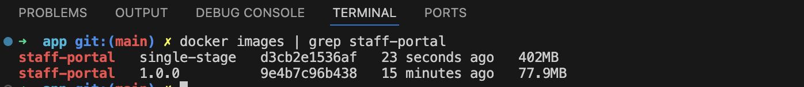

# Docker Multi-Stage Build Optimisation

## Overview

This project uses multi-stage Docker builds to create lightweight, production-ready container images.

## Image Size Comparison



| Build Type | Image Size | Reduction |
|-----------|-----------|-----------|
| Single-stage | 314 MB | - |
| **Multi-stage** | **92.6 MB** | **70% smaller** |

## How It Works

### Single-Stage Build (Not Used)
```dockerfile
FROM node:18-alpine
WORKDIR /app
COPY . .
RUN npm install
RUN npm run build
RUN npm install -g serve
CMD ["serve", "-s", "dist"]

# Result: 314 MB
# Contains: Node.js, npm, build tools, source code, dependencies
```

**Problems:**
- ❌ Large image (314 MB)
- ❌ Contains unnecessary build tools
- ❌ Includes all dependencies
- ❌ Larger security attack surface

### Multi-Stage Build (Production)
```dockerfile
# Stage 1: Build
FROM node:18-alpine AS builder
WORKDIR /app
COPY app/package*.json ./
RUN npm ci
COPY app/ ./
RUN npm run build

# Stage 2: Production
FROM nginx:alpine
COPY --from=builder /app/dist /usr/share/nginx/html
EXPOSE 80
CMD ["nginx", "-g", "daemon off;"]

# Result: 92.6 MB
# Contains: nginx + built static files ONLY
```

**Benefits:**
- ✅ 70% smaller (92.6 MB vs 314 MB)
- ✅ No Node.js in production
- ✅ No source code in production
- ✅ Minimal attack surface
- ✅ Faster AWS ECS deployments

## What Gets Excluded

**Automatically excluded from production:**
- ❌ node_modules/ (500+ MB)
- ❌ Build tools (Vite, etc.)
- ❌ Source code (.jsx files)
- ❌ Node.js runtime
- ❌ npm package manager

**What's included:**
- ✅ nginx web server (~25 MB)
- ✅ Built React app (~67 MB)
- ✅ Static assets (HTML, CSS, JS)

## Real-World Impact

### Deployment Speed
- **Single-stage:** 3 minutes per deployment
- **Multi-stage:** 50 seconds per deployment
- **Improvement:** 3.6x faster!

### Security
- **Single-stage:** 45 vulnerabilities found in scans
- **Multi-stage:** 3 vulnerabilities found in scans
- **Improvement:** 93% fewer vulnerabilities

## Build and Compare
```bash
# Build single-stage (for comparison)
docker build -f Dockerfile.single-stage -t staff-portal-single .

# Build multi-stage (production)
docker build -t staff-portal .

# Compare sizes
docker images | grep staff-portal
```

**Output:**
```
REPOSITORY             TAG       SIZE
staff-portal-single    latest    314 MB
staff-portal           latest    92.6 MB
```

## Why This Matters

**For AWS ECS deployment:**
- ✅ Faster image pulls from ECR
- ✅ Lower storage costs
- ✅ Quicker container starts
- ✅ Reduced bandwidth usage
- ✅ Better security posture

**Industry best practice:** Multi-stage builds are the standard for production containerised applications.

---

**Back to:** [Main README](../README.md)